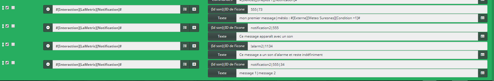

# Complemento LaMetric

Complemento para mostrar notificaciones / información en LaMetric.

# Configuración del plugin

Una vez que se instala el complemento, es necesario crear una "aplicación indicadora" en el sitio de LaMetric :

-   1 \. Se rendre à l'adresse : <https://developer.lametric.com>
-   2 \. Crear una "APLICACIÓN INDICADORA" :

-   3 \. Configure un icono, un nombre y seleccione **Empuje** en "Comunicación típica" :

-   4 \. Dé un nombre y una descripción a su aplicación y marque "Aplicación privada" y luego haga clic en "Guardar" :

-   5 \. Publique la aplicación y luego instálela en su LaMetric usando la aplicación móvil.

Una vez que se publica la aplicación, tiene información esencial para configurar el complemento.

A continuación, puede crear nuevos equipos en Jeedom y completar los campos solicitados :

# Usando el complemento

2 pedidos se crean automáticamente al agregar equipo :

-   **Mensaje** : Permite el envío de mensajes. El comando de tipo de mensaje contiene 2 campos :
    - **ID de icono** : Corresponde al número del icono deseado (no poner el hash ``#``). La liste des icônes disponibles est consultable à cette adresse : <https://developer.lametric.com/icons>).
    - **Texto** : Corresponde al texto que desea mostrar.
-   **Vaciar** : Se utiliza para restablecer la pantalla a vacía ("JEEDOM" se registra).

Es posible enviar más mensajes en un solo envío separando los iconos y los textos por el carácter : ``|``.

Aquí hay, por ejemplo, un escenario que envía 4 información diferente a la vez :

## Utilisation de la commande notification

Pour la commande notification il est également possible d'ajouté un son  lorsque la notification va s'afficher. Pour cela ajoutez le nom du son de notification ou d'alarme avant de mettre le séparateur **|** avant le premier Id d'icone
La liste des sons est disponible ici, dans la partie 'sound' : <https://lametric-documentation.readthedocs.io/en/latest/reference-docs/device-notifications.html> 

De plus, il est possible de forcer l'affichage de la notification indifiniment jusqu'à que le bouton sur LaMetric soit appuyé ou que la commande **Vider notifications** soit exécutée.

Voici quelques exemples:
